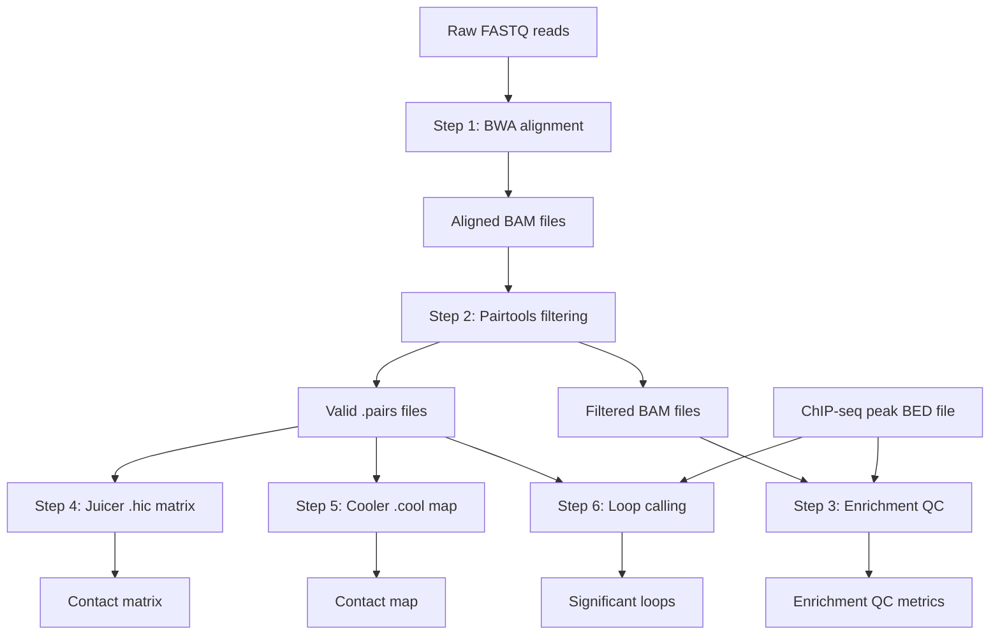

# HiChIP Seq SeaWulf Analysis Pipeline
This repo contains a set of scripts used for HiChIP sequencing analysis on the SeaWulf cluster at SBU.
The pipeline is not fully automated, so currently each step must be run in sequence. The purpose of this project is to make these scripts more portable and flexible (with the eventual goal that they be implemented in a nextflow workflow).

## Background
### Biological
High-throughput chromatin conformation capture with immunoprecipitation (HiChIP) is a powerful sequencing method that combines the 3D genome-mapping capability of Hi-C with the targeting specificity of ChIP-seq​.

By focusing on chromatin interactions associated with a protein of interest (e.g. a histone modification or transcription factor), HiChIP dramatically enriches for informative contacts, improving the yield of long-range reads by over ten-fold and reducing input requirements by ~100-fold compared to earlier methods like ChIA-PET.

HiChIP libraries achieve a higher signal-to-background ratio than conventional Hi-C, enabling detection of chromatin loops and interactions at high resolution with significantly less sequencing depth.

This approach has become an important tool in 3D genomics, allowing researchers to map protein-directed chromatin architecture and link regulatory elements in a cell-type specific manner.

### Computational
The computational workflow presented here analyzes HiChIP sequencing data and was adapted from the official [Dovetail Genomics HiChIP pipeline](https://hichip.readthedocs.io/en/latest/)

It implements the recommended steps for read alignment, valid pair extraction, quality control, contact map generation, and loop calling. The pipeline is designed for a high-performance computing environment (the SeaWulf cluster at Stony Brook University) using SLURM job scripts. Below, we describe each step in the six-part workflow (Steps 1–6), detailing the purpose of each SLURM script, the underlying tools and software dependencies, and how intermediate data products flow between steps.

## Workflow Overview
This pipeline takes raw paired-end FASTQ reads from a HiChIP experiment and produces both genome-wide contact maps and lists of statistically significant chromatin interactions (loops). The overall process follows these major steps:
1. Alignment of reads to the reference genome
  - Script: step1.bwa_map_reads.slurm → calls map_reads_2025.sh (alignment script)
  - Purpose: Map raw HiChIP sequencing reads to the reference genome (mm10 in this case) to produce sorted, aligned read files for each sample.
  - Output: For each sample, a sorted BAM file containing all aligned read pairs (<SAMPLE>.bam) is written to the bwa-mem_out directory. These BAM files serve as the input for the next step (pair filtering).
2. Identification of valid paired interactions and removal of duplicates
  - Script: step2.pairtools_process.slurm → calls pairtools_pipe.sh (pair filtering script)
  - Purpose: Identify valid HiChIP contacts from the aligned reads, enforce mapping quality filters, remove PCR duplicates, and output the interaction pairs in a standardized format. This step transforms the alignment data into a list of high-confidence paired contacts suitable for analysis.
  - Output: A .pairs file for each sample, representing the list of deduplicated valid contacts (each entry includes the two genomic coordinates and orientation of a contacting read pair). This is the primary output needed for building contact maps. Additionally, a filtered BAM of valid paired reads is produced (for potential visualization or reuse) along with its index and a summary stats file. The .pairs output from this step feeds into Steps 4–6, while the stats can be used in QC assessments (Step 3).
3. Library quality assessment and enrichment analysis at ChIP peak loci
  - Script: step3.enrichment.slurm → calls get_enrichment_stats.sh (QC metrics script)
  - Purpose: Evaluate the enrichment of HiChIP read pairs around known binding sites of the target protein, providing quality metrics for the library. This step checks whether the HiChIP experiment successfully captured interactions centered on ChIP-seq peak regions (the expected signal), versus background.
  - Output: A text report of HiChIP QC metrics (for example, <SAMPLE>_hichip_qc_metrics.txt), listing values such as fraction of reads near peaks and O/E enrichment ratios. This report allows the user to assess library quality (e.g. sufficient enrichment and complexity) before proceeding to loop calling. This step does not produce an output that is used in subsequent pipeline steps; it is an analytical readout for QC only. However, the peak file used here will also be needed for the loop calling in Step 6.
4. Generation of a Hi-C contact matrix in .hic format for visualization
  - Script: step4.juicer_contact_matrix.slurm (runs Juicer Tools)
  - Purpose: Convert the list of valid pairs (contacts) into a genome-wide contact matrix in the .hic format, which is a binary format used for efficient storage, sharing, and visualization of Hi-C/HiChIP maps (in Juicebox).
  - Output: A <SAMPLE>.hic file containing the contact matrix for that sample at multiple resolutions​. This file is primarily for visualization and sharing. It is not explicitly consumed by later steps in this pipeline (Step 6 uses a different approach for loop calling)
5. Generation of a binned contact map in Cooler (.cool) format
  - Script: step5.cooler_contact_map.slurm (runs Cooler cload pairix)
  - Purpose: Generate a contact matrix in Cooler format (.cool), which is an HDF5-based sparse matrix format widely used for Hi-C data analysis in Python. In this case, a single-resolution contact map (1 kb bins) is created for downstream analysis or visualization.
  - Output: A <SAMPLE>.cool file storing the contact matrix at 1 kb resolution​.
6. Chromatin loop calling to identify significant interactions
  - Script: step6.run_fithichip.slurm (runs FitHiChIP via its HiC-Pro integration script)
  - Purpose: Identify statistically significant chromatin interactions (loops) from the HiChIP contact data, using peaks as anchors. This is the final analytical step, yielding a list of chromatin loops enriched for the protein of interest.
  - Output: For each sample, FitHiChIP produces a set of loop calls, typically as a text file.

