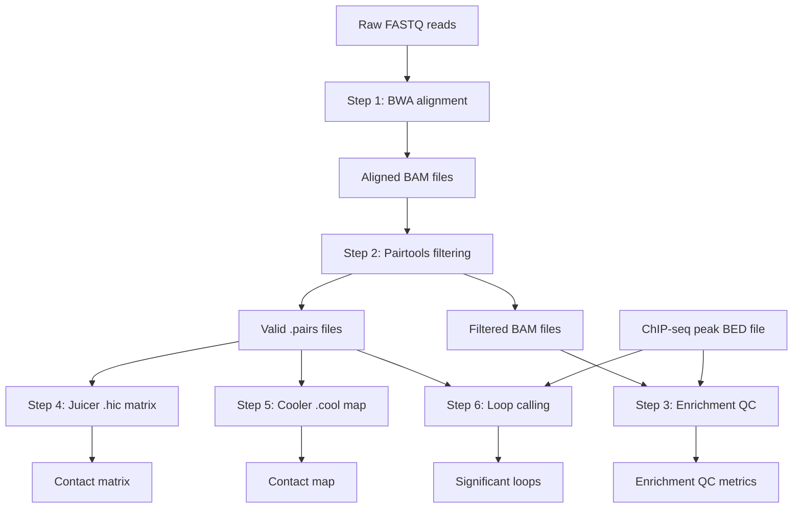

# HiChIP Seq SeaWulf Analysis Pipeline
This repo contains a set of scripts used for HiChIP sequencing analysis on the SeaWulf cluster at SBU.
The pipeline is not fully automated, so currently each step must be run in sequence. The purpose of this project is to make these scripts more portable and flexible (with the eventual goal that they be implemented in a nextflow workflow).

## Background
### Biological
High-throughput chromatin conformation capture with immunoprecipitation (HiChIP) is a powerful sequencing method that combines the 3D genome-mapping capability of Hi-C with the targeting specificity of ChIP-seq​.

By focusing on chromatin interactions associated with a protein of interest (e.g. a histone modification or transcription factor), HiChIP dramatically enriches for informative contacts, improving the yield of long-range reads by over ten-fold and reducing input requirements by ~100-fold compared to earlier methods like ChIA-PET.

HiChIP libraries achieve a higher signal-to-background ratio than conventional Hi-C, enabling detection of chromatin loops and interactions at high resolution with significantly less sequencing depth.

This approach has become an important tool in 3D genomics, allowing researchers to map protein-directed chromatin architecture and link regulatory elements in a cell-type specific manner.

### Computational
The computational workflow presented here analyzes HiChIP sequencing data and was adapted from the official [Dovetail Genomics HiChIP pipeline](https://hichip.readthedocs.io/en/latest/)

It implements the recommended steps for read alignment, valid pair extraction, quality control, contact map generation, and loop calling. The pipeline is designed for a high-performance computing environment (the SeaWulf cluster at Stony Brook University) using SLURM job scripts. Below, we describe each step in the six-part workflow (Steps 1–6), detailing the purpose of each SLURM script, the underlying tools and software dependencies, and how intermediate data products flow between steps.

## Workflow Overview
This pipeline takes raw paired-end FASTQ reads from a HiChIP experiment and produces both genome-wide contact maps and lists of statistically significant chromatin interactions (loops). The overall process follows these major steps:
1. Alignment of reads to the reference genome
2. Identification of valid paired interactions and removal of duplicates
3. Library quality assessment and enrichment analysis at ChIP peak loci
4. Generation of a Hi-C contact matrix in .hic format for visualization
5. Generation of a binned contact map in Cooler (.cool) format
6. Chromatin loop calling to identify significant interactions

